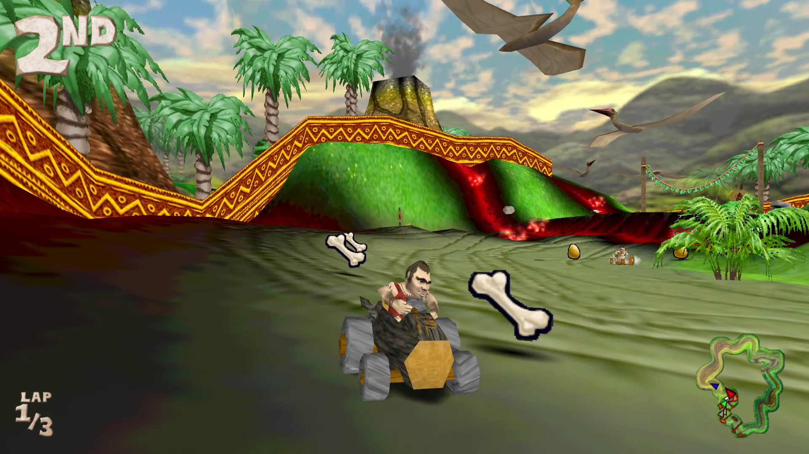

# Cro-Mag Rally

## *The wildest racing game since man invented the wheel!*

This is a port of Pangea Software’s racing game **Cro-Mag Rally** to modern operating systems.

**Download the game for macOS, Windows and Linux here:** https://github.com/jorio/CroMagRally/releases

## About Cro-Mag Rally

> In Cro-Mag Rally you are a speed-hungry caveman named Brog who races through the Stone, Bronze, and Iron Ages in primitive vehicles such as the Geode Cruiser, Bone Buggy, Logmobile, Trojan Horse, and many others. Brog has at his disposal an arsenal of primitive weaponry ranging from Bone Bombs to Chinese Bottle Rockets and Heat Seeking Homing Pigeons.
> 
> In addition to single-player racing where one player races against the computer, there are also several different multi-player modes including Tag, Capture the Flag, and Survival. Up to four players can play on a single computer in split-screen mode.

CMR was released in 2000 by Pangea Software as a Mac exclusive, and it was a pack-in game on Macs that came out around that time.

## About this port

This is a port of the original OS 9 version of the game. It aims to provide the best way to experience CMR on today’s computers. It is an “enhanced” version insofar as it fixes bugs that may hinder the experience, and it brings in a few new features in keeping with the spirit of the original game.

Some of the new features include:
- Up to 4 players in split-screen multiplayer (up from 2 in the original).
- The UI is subtly animated and has been tweaked to be pleasant to look at on modern widescreens.
- Enable a timer in race modes to hone your racing skills, and keep track of your records in the all-new scoreboard!

I haven’t had time to restore NetSprockets multiplayer from the OS 9 version yet, but that may come in a later release.

### More documentation

- [BUILD](BUILD.md) – How to build the game from source
- [CHANGELOG](CHANGELOG.md) – Cro-Mag Rally version history
- [LICENSE](LICENSE.md) – Licensing info (see also below)
- [SECRETS](SECRETS.md) – Cheat codes!

### Legal info

Cro-Mag Rally © 2000 Pangea Software, Inc. Cro-Mag Rally is a trademark of Pangea Software, Inc. This version was made and re-released here (https://github.com/jorio/CroMagRally) under permission from Pangea Software, Inc.

This version is licensed under [CC-BY-NC SA 4.0](LICENSE.md).

## More Pangea stuff!

Check out my ports of [Bugdom](https://github.com/jorio/Bugdom), [Nanosaur](https://github.com/jorio/Nanosaur), [Mighty Mike (Power Pete)](https://github.com/jorio/MightyMike) and [Otto Matic](https://github.com/jorio/OttoMatic).

All ports are free of charge! If you’d like to support the development of Pangea game ports, feel free to visit https://jorio.itch.io and name your own price for any of the games there. Much appreciated! 😊
